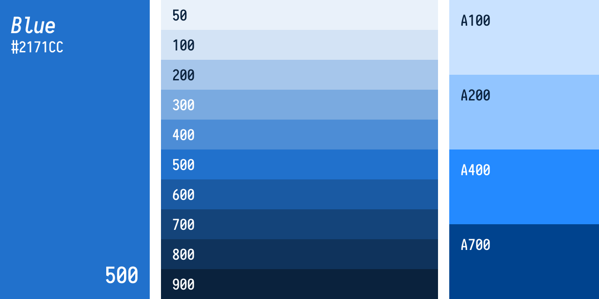

After painstakingly creating [Material Design -inspired color palettes](https://material.io/guidelines/style/color.html#color-color-tool) for [Verkkokauppa.com](https://www.verkkokauppa.com/)'s colors _by hand_ and still not getting them _just right_, I figured there had to be a better way to generate nice palettes.

I decided to write a simple npm package containing an importable SCSS file for using colors. In this post I'll detail the two functions necessary for creating a palette from a single base color.

## SCSS Functions To The Rescue!



Verkkokauppa.com's shade of blue used is <span style="background-color:#2171CC;color:white">#2171CC</span>. We define the function `Blue()` for using any shade of blue as illustrated in the image above like so:

````scss
@function Blue($lightness: 500) {
 $base: #2171CC;
 $map: (
   50:   mix(white, $base, 90%),
   100:  mix(white, $base, 80%),
   200:  mix(white, $base, 60%),
   300:  mix(white, $base, 40%),
   400:  mix(white, $base, 20%),
   500:  $base,
   600:  mix(black, $base, 20%),
   700:  mix(black, $base, 40%),
   800:  mix(black, $base, 55%),
   900:  mix(black, $base, 70%),
   A100: saturate(mix(white, $base, 80%), 40),
   A200: saturate(mix(white, $base, 60%), 40),
   A400: saturate(mix(white, $base, 20%), 60),
   A700: saturate(mix(black, $base, 40%), 60)
 );

 @return adjustedColor($base, $map, $lightness);
}
````

What happens here is that the function `Blue()` takes an argument `$lightness` (defaulting to _500_), looks up from the `$map` if a matching color is available, and then returns the converted color.

The map contains lightness values as defined in the Material Design palettes. I decided that instead of specifying them by hand, I'll use SCSS's built-in color functions for mixing the base color with either _black_ or _white_. The highlight colors are also a bit more saturated.

----

Now we'll get to `adjustedColor()`. It's a generic function so that I only have to define it once (you'll have a single function for each color, all reusing this). It takes arguments and looks up the requested color from the `$map`, falling back to the default `$base` color:

````scss
@function adjustedColor($base, $map, $lightness) {
 @if map-has-key($map, $lightness) {
   @return map-get($map, $lightness)
 } @else {
   @return map-get($map, 500);
   @warn "Invalid Lightness value: `#{$lightness}`. Reverting to default 500. Valid lightnessValues are: `#{map-keys($map)}`."
 }
}
````

If a color shade is not defined, it additionally emits a warning.

## Usage in production

That's pretty much it. As I said, I made this into an npm package containing all the colors in a `colors.scss` file. There's an additional `colors.css` for hipsters who wish to use _next-gen_ [CSS variables](http://cssnext.io/). Also included is a `preview.html` file created in React which simply showcases the available palettes.

To use in a project, you just install the package `yarn add colors --dev` and then in SCSS import it with `@import "colors/colors.scss"` _(assuming something like Webpack resolves node module paths)_.

Finally, in your SCSS code you can start using colors like `background-color: Red()` or `color: White(100)` _(that's a joke, I included `Black()`and `White()` that simply return the obvious)_.
