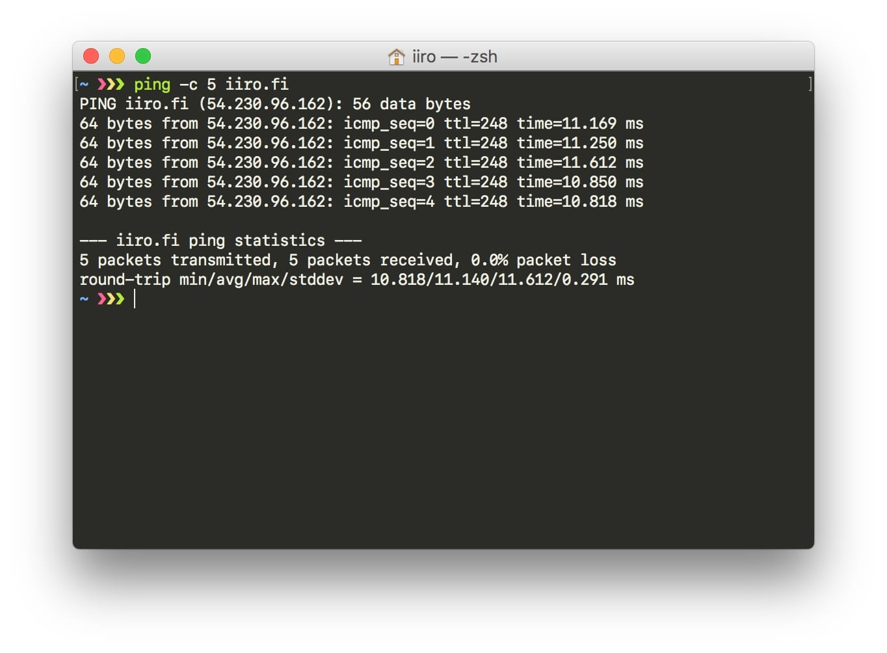
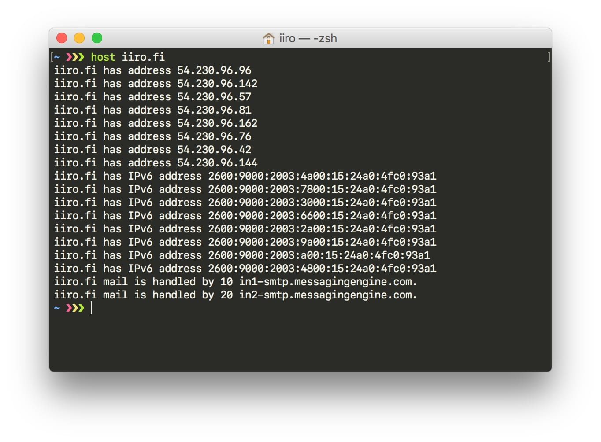
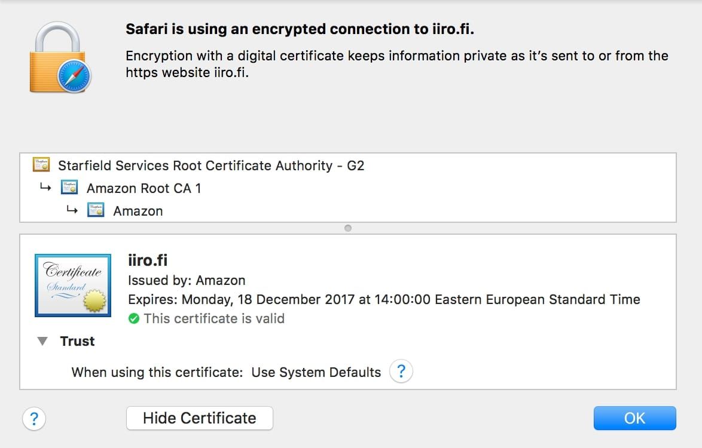

>I want to start blogging. Now, what tech stack should I use?

That was my first thought when I decided to start blogging. This readme is about how I made this blog. Maybe great content will follow great technical decisions by itself.

## TL;DR

1. Blog posts are markdown files
2. Gatsby renders React to static HTML *(it's really neat, you should check it out)*
3. Static HTML is synced to an Amazon S3 bucket
4. Amazon Cloudfront caches the static files all over the world
5. Amazon Route 53 DNS tells your browser to connect to the closest Cloudfront edge location
6. You read this blog, **fast**

## Preface

My personal websites have always been somewhat placeholder. Just a single static html file with some CSS. No JavaScript needed, works everywhere, loads fast. I value this so one requirement for finding a good blogging platform was that it produced fast, static and no-JS-compliant output.

I have been fascinated by React, though. We use React at [Verkkokauppa.com](https://www.verkkokauppa.com) so even though I do not code in my current job I am always around and get to soak in knowledge from my coworkers. I have learned quite a bit of modern front-end coding and wanted to put my news skills to use. This is why React was another requirement for a good blogging platform.

Markdown is a neat and logical way to find. You can open a _.md_ in any text editor and understand its syntax. It's portable and universal. I wanted my blogging platform to support Markdown.

## Gatsby

>Transform plain text into dynamic blogs and websites using the latest web technologies. A React.js static site generator.
><cite>Gatsby Readme</cite>

[Gatsby](https://github.com/gatsbyjs/gatsby) promised me everything I needed. Turn your folder structure into the site map, use Markdown files, compile React to static HTML. What more could I need? Using Gatsby I had a nice framework to build my blog on. It even works without JavaScript because it compiles all the routes into HTML. This is next-gen progressive web app stuff; React enhances the usability of my blog (over its non-js version) by allowing instant loading without page reloads.

You should definitely [give Gatsby a try](https://github.com/gatsbyjs/gatsby). You can even use my blog as a starting point as I've open-sourced it (sans image originals). Please find the [GitHub repo here](https://github.com/iiroj/iiro.fi).

## Serverless

I have a custom-built NAS at home. It's built into a 4-bay [U-NAS enclosure ](http://www.u-nas.com/product/nsc400.html) using a [Supermicro](https://www.supermicro.com/products/motherboard/X11/X11SBA-LN4F.cfm) Braswell embedded motherboard. Currently it only serves as my backup destination with 2x3 TB WD Red drives in a ZFS pool.

You might have guessed by the description that I like servers. I've always hosted my ~~simple static~~ websites myself on either VPS or dedicated hosted servers. I started on a $5 [Digital Ocean](https://github.com) droplet as donated through GitHub's educational program. I've went through a lot of services: dedicated Atom server at [Online.net](https://www.online.net/en), VPS at [OVH](https://www.ovh.com), dedicated ARM server at [Scaleway](https://www.scaleway.com), and so on. It's been a nice circle of learning hopping between services.

My latest server was a dedicated one from Onlinet.net, the [Dedibox XC 2016](https://www.online.net/en/dedicated-server/dedibox-xc). That model features a Supermicro [Intel C2750](https://ark.intel.com/products/77987/Intel-Atom-Processor-C2750-4M-Cache-2_40-GHz) embedded system with 8 Atom cores at 2.4 GHz, 16 GB DDR3 RAM, a 250 GB SSD (Sata II only) and an unmetered 2.5 Gbit/sec network interface. Pretty powerful stuff.

This is a waste, though. I only ever publish some 200 KB of documents, all static. Why should I pay 20€ a month for a dedicated 8-core Atom server to serve these files? Besides, that's only another place for me to obsessively run `sudo apt-get update` twice a day (Yes, I run Ubuntu on my NAS). I've read a lot about [Amazon S3](http://docs.aws.amazon.com/AmazonS3/latest/dev/Welcome.html) and decided that now is the time. I already moved all my previous sites over from the server to AWS. It was the best decision of my life (in this context).

### The AWS ecosystem

After deciding to turn off my server and move on to S3 I started finding out how to do it. Instead of one service/box doing everything, I would have a lot of smaller services working together. Writing an NPM script for deploying to an S3 bucket was easy. In the AWS control panel I found a way to put the S3 bucket into a website hosting mode. Now I had a working web server — although the URL was wrong, there was no TLS and I guess caching was non-existing. The server was also physically very far and my pings were too high; my last dedicated server from Onlinet.net was in AMS-1 so pings were the same at around 30 ms. Why would I make this change if it didn't improve anything (well, apart from the obvious cost).

To solve all my issues at once I found [Cloudfront](https://aws.amazon.com/cloudfront/) from the same AWS control panel. Cloudfront is a CDN that I point to my S3 bucket. It then synchronizes some 20 edge locations (I chose the cheapest pricing) in the EU, US and Canada to my bucket's contents. It supports TLS and HTTP/2 out-of-the-box. I could also add a CNAME to it so I could use my domain name. This was relatively easy and now I had a working Cloudfront CDN service with pings of ~11 ms (based in Stockholm, Sweden).

To actually work with my own domain name I had to change some DNS settings to point it to Cloudflare. This wasn't easy, as I cannot use a CNAME record for the naked, apex domain _iiro.fi_. I had to move my DNS hosting over to Amazon as well. The [Route 53](https://aws.amazon.com/route53/) service allows this via a custom _alias record_. Besides, Route 53 gives me 4 DNS endpoints and is really fast. I can also control it from the same control panel! I had now put all my eggs in Amazon's basket, apart from the domain name registrations. I guess it doesn't matter, Amazon should be too big to fail.

One last thing was to get a TLS certificate for my domain name. I had used [Let's Encrypt](https://letsencrypt.org) with my own server. I searched around and could create an [AWS Lambda](https://aws.amazon.com/lambda/) function to continue using Let's Encrypt and send the files to [Amazon Certificate Manager](https://aws.amazon.com/certificate-manager/). But wait a minute… from Certificate Manager I found I get just as nice domain-validated certificates directly! They're signed by Amazon itself. So I went with that to keep things simple. Now my domain name was working and secured.

### Cost

My dedicated server cost me _20 € a month_. What do all these AWS services cost? I do not know yet, since I got a [free year](https://aws.amazon.com/free/)'s worth of services with some monthly limitations. Currently my billing dashboard is showing my $3.13, of which Route 53's costs are $2.51 (a fixed rate for hosting all my domains' DNS zones) and $0.60 tax. For S3 I'm to pay $0.02. It seems this is practically free, but that's just my two cents.

## About this blog

I've now spent some months on-and-off working on this blog, including infrastructure and coding. In addition to that, I've spent all of 15 minutes thinking about _what to blog about_. I intend to use this to vent my thought on UX and UI stuff I learn, share nice links and maybe post the occasional kitty picture. This will also server as my résumé and portfolio, of which the latter I will work on later. Maybe it'll get dusty and work as a static landing page for my contact details.

In any case, this is a cheap and very fast way of hosting a static website.
